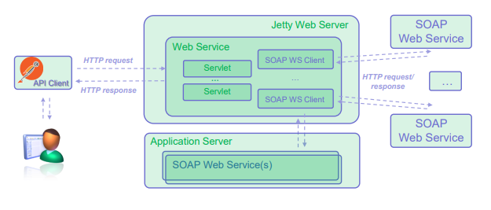

# SOAP_server
Service that utilizes one external and one self-made SOAP services to implement own business logic. The *service_orchestrator* is a Jetty-based API that utilizes the *Calculator_WS* -SOAP service and an external numbers2words-converter -SOAP-service.

